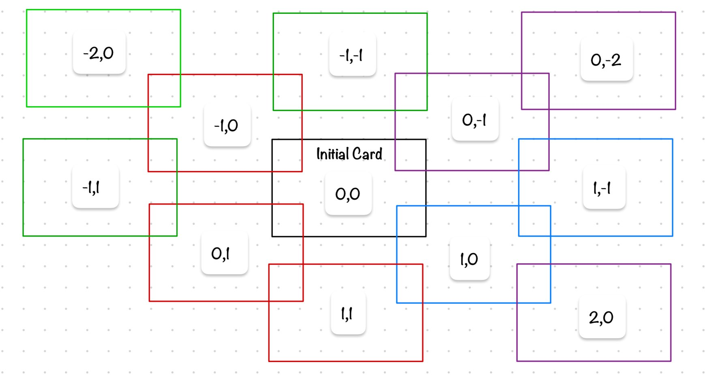
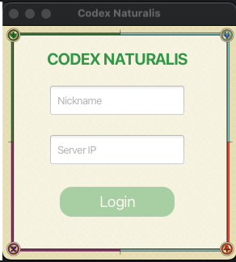
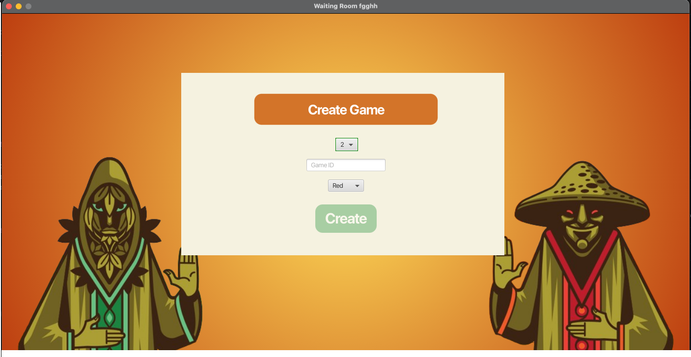
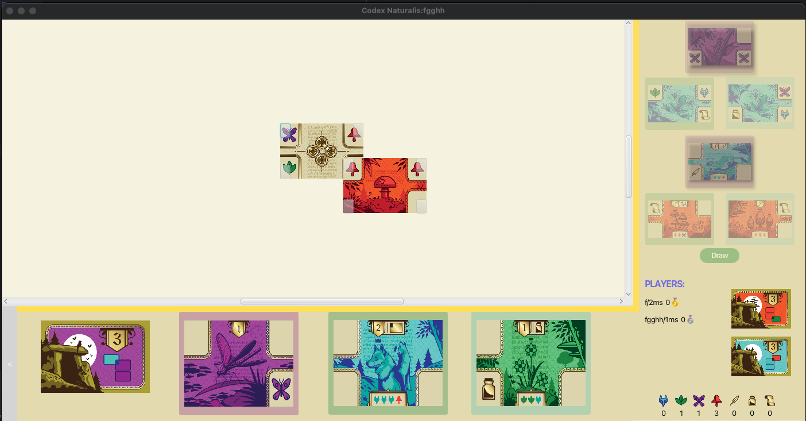
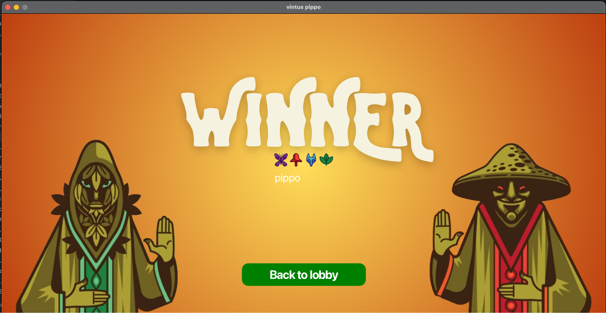

### ing-sw-2024-Alberti-Capodanno-Duina-Dussin

# BOARD GAME [Codex Naturalis](https://www.craniocreations.it/prodotto/codex-naturalis)


The game is a 2–4 player turn-based game where players have to collect cards to complete the Codex Naturalis.
The games are based on and MVC a pattern, where the server is the model and controller and the clients are the view that
can be CLI or GUI. The server is also responsible for the communication between the clients and the game logic.

Grade:30/30

## GRUPPO AM45

- ### 259745  [Alberti Emanuele](https://github.com/...) <br>Email: emanueleemilio.alberti@mail.polimi.it
- ### 986391  [Capodanno Mario](https://github.com/MarioCapodanno) <br>Email: mario.capodanno@mail.polimi.it
- ### 984779  [Duina Giorgio](https://github.com/...) <br>Email: giorgio1.duina@mail.polimi.it
- ### 981292  [Dussin Michele](https://github.com/...) <br>Email: michele.dussin@mail.polimi.it

## FUNCTIONALITIES

| Functionality         | Base | Advanced |
|:----------------------|:----:|:--------:|
| Basic rules           |  🟢  |          |
| Complete rules        |  🟢  |          |
| Socket                |  🟢  |          |
| RMI                   |  🟢  |          |
| GUI                   |  🟢  |          |
| TUI                   |  🟢  |          |
| Multiple games        |      |    🟢    |
| Chat                  |      |    🟢    |
| Connection Resilience |      |    🔴    |
| Persistence           |      |    🔴    |

🔴 waiting...  
🟢 done  
🟡 work in progress...

## DOCUMENTATION

### UML

UML diagrams for the entire project, including all classes, as well as separate uml diagrams for the model, controller, network, enumeration, and view components, are available in the `documents/uml` folder.


### How to use JARs 

We create it with Maven Shade Plugin  
For server     ``` java -jar AM45-1.0-SNAPSHOT-server.jar [-ip <ipAddressr>] [-pRMI <numberPort>] [-pTCP <numberPort>] ```  
For a client  ``` java -jar AM45-1.0-SNAPSHOT-client.jar [-cli] [-gui] [-tcp] [-rmi] ```  


### JavaDoc

The following documentation includes a description for most of the classes and methods used, follows the Java
documentation techniques, and can be accessed by generating it from code or
here the folder `Documents/javadoc`.  
Starts from index.html.

### TEST COVERAGE FOR CONTROLLER 

| Controller Class      | Method Coverage | Line Coverage | Notes   |
|-----------------------|-----------------|---------------|---------|
| `GamesController`     | 87%             | 73%           | Class   |
| `Client.cts`          | 100%            | 78%           | Package |

### TEST COVERAGE FOR MODEL

| Model Classes/Packages | Method Coverage | Line Coverage | Notes |
|------------------------|-----------------|---------------|-------|
| `GameBoard`            | 75%             | 82%           | Class |
| `PlayerBard`           | 81%             | 84%           | Class |
| `ScoreBoard`           | 100%            | 93%           | Class |
| `ObjectiveCards`       | 100%            | 90%           | CLass |
| `GoldCards`            | 88%             | 89%           | Class |
| `Card`                 | 100%            | 100%          | Class |
| `Deck`                 | 86%             | 89%           | Class |
| `Hand`                 | 90%             | 87%           | Class |
| `Player`               | 90%             | 94%           | Class |
| `Game`                 | 75%             | 71%           | Class |

### LIBRARIES AND PLUGINS (used and recommended by the course)

| Library/Plugin | Description                                                             |
|----------------|-------------------------------------------------------------------------|
| __Maven__      | Build automation tool used primarily for Java projects.                 |
| __JavaFx__     | Graphic library to create user interfaces (more innovative than Swing). |
| __JUnit__      | Unit testing framework (recommended by the course).                     |    
| __Mockito__    | Mocking framework for unit tests in Java                                |    
| __JSON__       | JSON processing libraries                                               |    


### OTHER USEFUL INFORMATION:

- Peer-reviews, JavaDoc (generable from intellij) and network protocol messages are in the deliverables folder.
- GUI:
  - To connect to the server in RMI with the GUI, enter "rmi-yourip" in the text box.
  - To connect to the server in TCP with the GUI, enter "yourip" in the text box.
  - Open the chat with the button on the bottom left of the screen.
  - Open leaderboard by clicking on "PLAYERS:".
  - Open other players' board by clicking on their name.
  
- TUI guide to placing cards:

    - To place a card, enter the coordinates (x,y) of the card you want to place. For example, to place a card in the bottom right of another card (x,y), enter (x+1,y). 
  


### GAME SCREENSHOTS
- LOGIN SCREEN


- LOBBY SCREEN


- GAME SCREEN


- WINNER SCREEN




